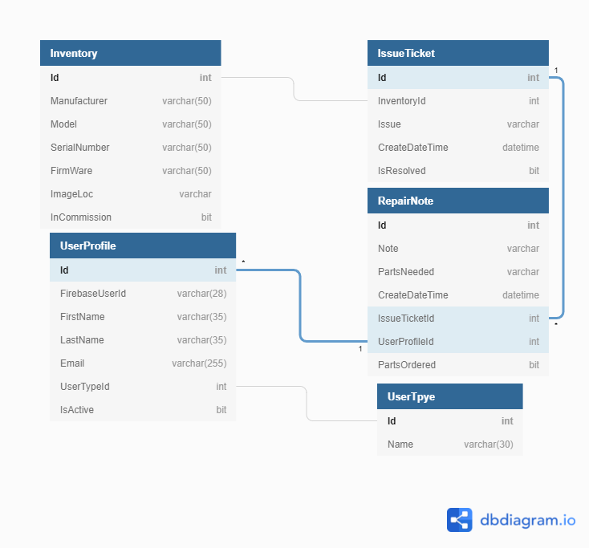

# REPAIRTRACK

## RepairTrack is a repair tracker that could be configured for any business where a record of inventory repairs or issues are needed. It has a .NET backend that handles the API and Database integration and a React front end with a simple FireBase Authentication.

### A User can log in and see a list of IssueTickets that are unresolved that could be worked on. The user can also choose an Inventory Item and create a new Issue Ticket for that Item or choose an Issue Ticket that has already been created. Once an Issue Ticket is chosen or created the User can look at the associated Repair Notes by various technicians across time or create new Repair Notes that document the Technicians findings and whether parts are needed and if so whether they have been ordered. Issue Tickets can be edited to show if the issue has been resolved or not.

